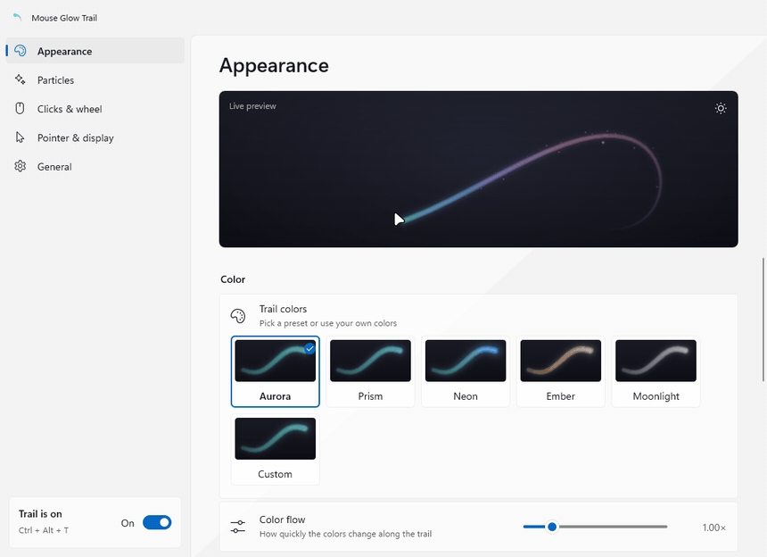
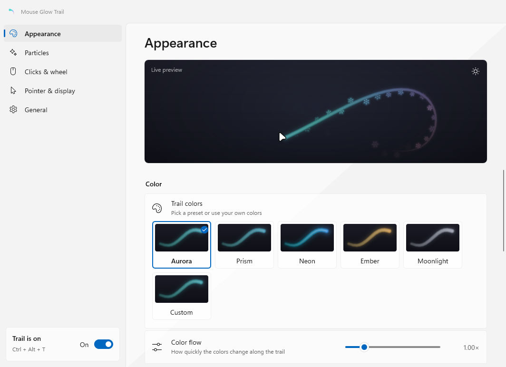
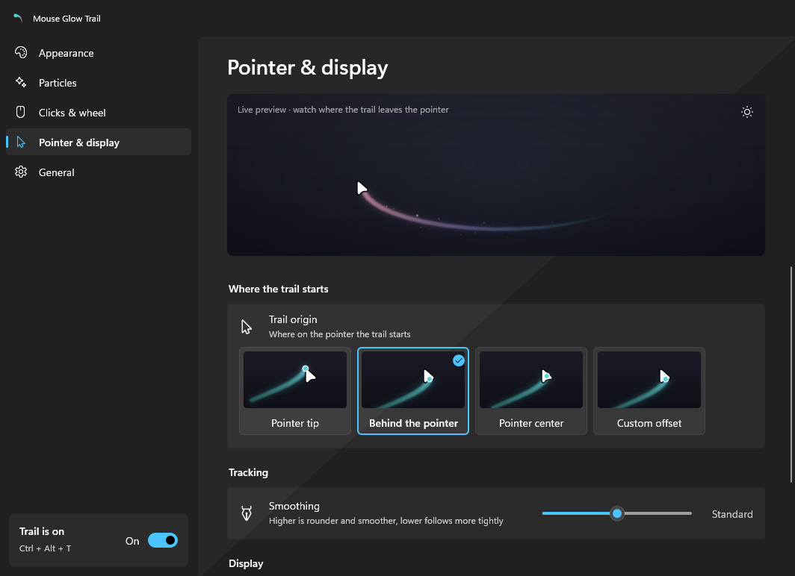
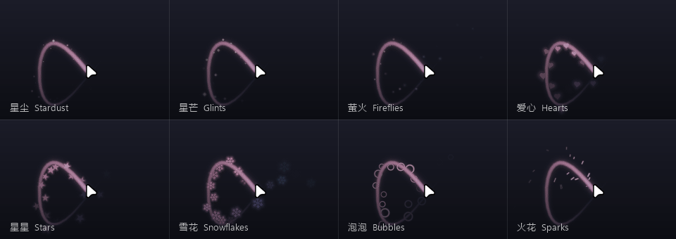
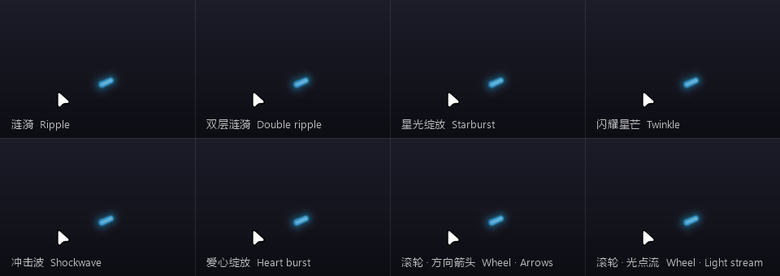

<div align="center">

# Mouse Glow Trail

**A soft, glowing ribbon that follows your mouse pointer on Windows: smooth at any refresh rate, never in the way of a click, and practically free when the pointer rests.**

English · [简体中文](README.zh-CN.md)


</div>

## Features

- **Silky trail.** It is drawn in step with your display's refresh rate (60, 144, 180 Hz…), smoothed with a One Euro filter, and follows every pointer shape (arrow, I-beam, hand, resize), so it never breaks mid-gesture.
- **Never in the way.** The overlay is fully click-through, works across monitors with mixed scaling, and hides itself in full-screen games, videos and slideshows.
- **Five hand-tuned styles plus your own colors.** Pick Aurora, Prism, Neon, Ember or Moonlight, or build a gradient from up to six colors of your own.
- **Eight particle kinds.** Stardust, glints, fireflies, hearts, stars, snowflakes, bubbles and sparks.
- **Click and wheel effects.** Choose a separate effect and color for the left, right and middle buttons: ripple, double ripple, starburst, twinkle, shockwave or heart burst. The wheel can show arrows, a light stream or ripples.
- **A proper control panel.** A native Windows 11 design with Mica, light and dark themes, and your accent color. A live preview uses the real renderer and your own pointer. The panel is fully usable from the keyboard.
- **Light on resources.** About 10 MB of memory. While you move the mouse it uses around 5% of one CPU core (180 Hz, default look); at rest, close to nothing. Optional GPU rendering (Direct3D 11 + DirectComposition) produces pixel-identical output.
- **Private.** No network access, no telemetry, no mouse hooks. It is a single portable exe of about 13 MB with no runtime to install.
- **Bilingual.** Chinese and English; by default it follows your Windows display language.

## Download

Get **`MouseGlowTrail-<version>-win-x64.zip`** from the [latest release](../../releases/latest), unzip it anywhere and run `MouseGlowTrail.exe`. A comet icon appears in the notification area.

- Windows 11, x64. Windows 10 should work (no Mica there) but has not been tested.
- The exe is not code-signed, so SmartScreen may warn the first time. Choose **More info → Run anyway**, or build it yourself (see below).
- To start it with Windows, turn on **General → Start with Windows** in the control panel.

## Using it

| | |
| --- | --- |
| Click the tray icon | Open the control panel (running the exe again does the same) |
| Right-click the tray icon | Quick menu: pause, style, opacity, particles, start with Windows, quit |
| `Ctrl + Alt + T` | Pause / resume |
| `Ctrl + Alt + Q` | Quit |

### Control panel



| Page | What you can change |
| --- | --- |
| **Appearance** | Style or custom colors (with a color picker), color flow, length, width, opacity, glow, core highlight, speed-dependent width, tapered tail |
| **Particles** | Kind, amount, size, drift, color |
| **Clicks & wheel** | Effect and color per mouse button, scroll effect, effect size |
| **Pointer & display** | Where the trail starts (tip, behind, center or a custom offset), smoothing, hiding in full-screen apps and while selecting text |
| **General** | On/off, start with Windows, GPU acceleration, language, shortcuts, restore defaults |

<p align="center">
  
  
</p>

### Particles



### Click and wheel effects



## How it stays light

- **Rendering.** A software rasterizer built on analytic distance fields, AVX2-vectorized, with "brightest wins" compositing, so a ribbon has no seams or dark beads at its joints. Only the part of the screen that changed is uploaded to the compositor.
- **Idle.** When the pointer rests, the render thread sleeps until Windows reports mouse input (Raw Input), with a slow fallback check for pens and programs that move the pointer.
- **GPU path (optional).** The same shading, evaluated in HLSL shaders. A test suite checks that it matches the CPU output pixel for pixel. It only pays off for bold, long trails, and the graphics driver alone costs about 40–50 MB of memory, so it is off by default.
- **Scroll effect.** The wheel cannot be polled, so while a scroll effect is enabled the app keeps receiving Raw Input notifications. That adds about 3% to its own CPU use.

## Building from source

Requires the [.NET 10 SDK](https://dotnet.microsoft.com/download) on Windows.

```powershell
dotnet publish MouseGlowTrail/MouseGlowTrail.csproj -c Release -o publish
```

This produces a trimmed, self-contained `publish/MouseGlowTrail.exe`. The project uses pure Win32, Direct2D, DirectWrite, Direct3D 11 and DirectComposition through P/Invoke and COM vtable calls, with no WinForms, WPF or third-party packages.

`MouseGlowTrail.Bench` is the development harness: invariant checks (`verify`), benchmarks, the preview images and README animations, and scripts that drive the real overlay and control panel. See [its README](MouseGlowTrail.Bench/README.md) (in Chinese).

```powershell
dotnet run --project MouseGlowTrail.Bench -c Release -- verify
```

## Settings and uninstalling

Settings live in `%APPDATA%\MouseGlowTrail\settings.json`. To uninstall:

1. Turn off *Start with Windows*.
2. Quit the app.
3. Delete the exe and that folder.

## License

[MIT](LICENSE)
