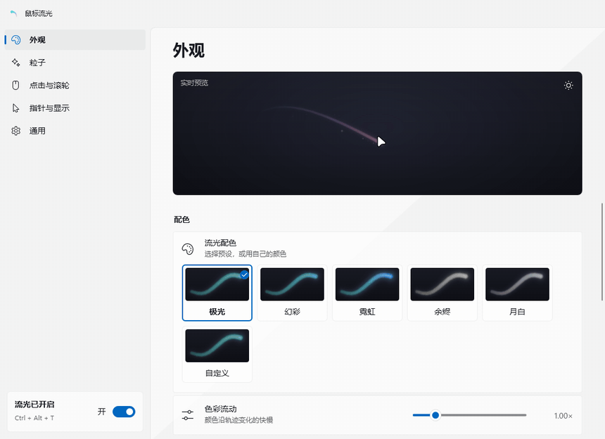
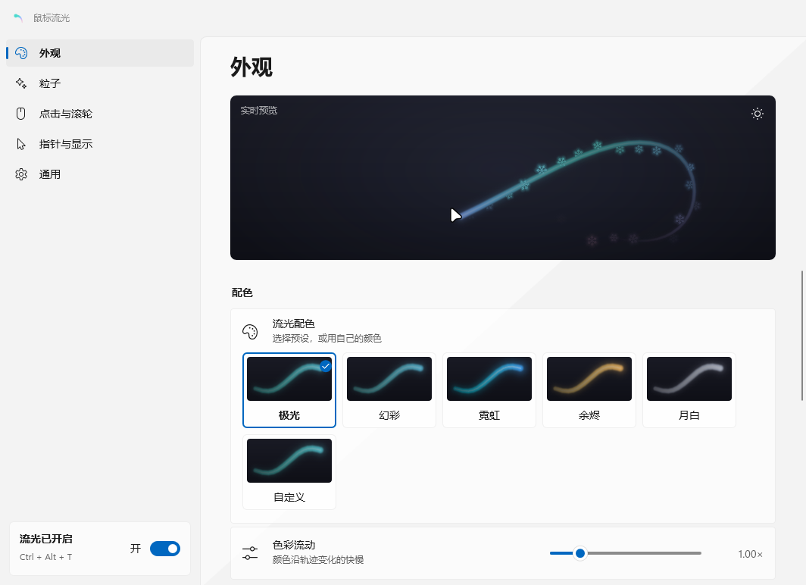
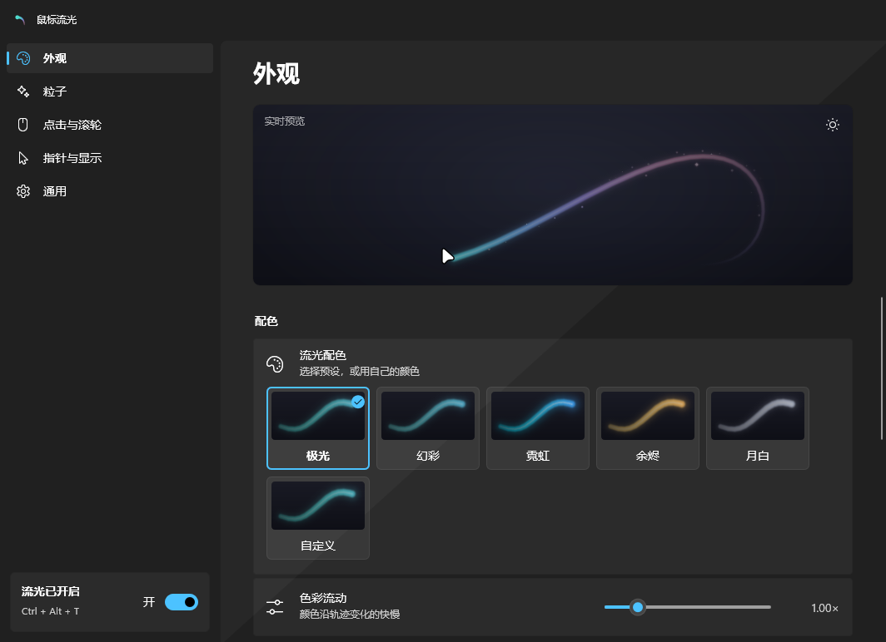

<div align="center">

# 鼠标流光 Mouse Glow Trail

**让鼠标指针拖出一条柔和发光的丝带。跟随显示器刷新率丝滑绘制，完全不挡鼠标点击，指针静止时几乎不占资源。**

[English](README.md) · 简体中文


</div>

## 特色

- **丝滑**：按显示器刷新率同步绘制（60、144、180 Hz……），用 One Euro 滤波平滑轨迹。箭头、文本 I 形、手形、缩放箭头等任何形状的指针都能跟随，划动途中不会断开。
- **零干扰**：叠加层完全穿透点击，支持多屏和混合缩放。全屏的游戏、视频和演示中会自动隐藏。
- **配色**：5 种精调预设（极光、幻彩、霓虹、余烬、月白），也可以用最多 6 种自选颜色组成渐变。
- **8 种粒子**：星尘、星芒、萤火、爱心、星星、雪花、泡泡、火花。
- **点击与滚轮效果**：左键、右键、中键可以分别设置效果和颜色，效果有涟漪、双层涟漪、星光绽放、闪耀星芒、冲击波、爱心绽放。滚轮可以显示方向箭头、光点流或涟漪。
- **精致的控制面板**：Windows 11 原生风格，有云母背景，支持深色和浅色主题，跟随系统强调色。实时预览使用真正的渲染器和你自己的指针。可以全程用键盘操作。
- **轻量**：内存约 10 MB。移动鼠标时约占一个 CPU 核心的 5%（180 Hz、默认外观），静止时几乎为零。可选 GPU 绘制（Direct3D 11 + DirectComposition），画面与 CPU 绘制逐像素相同。
- **隐私**：不联网、不收集任何数据、不安装鼠标钩子。单个免安装 exe，约 13 MB，不需要另装运行库。
- **双语**：中文和英文，默认跟随 Windows 显示语言。

## 下载

从[最新发布](../../releases/latest)下载 **`MouseGlowTrail-<版本>-win-x64.zip`**，解压到任意位置，运行 `MouseGlowTrail.exe`，托盘里会出现彗星图标。

- 系统要求：Windows 11 x64。Windows 10 应该也能用（没有云母背景），但未经测试。
- exe 没有代码签名，首次运行时 SmartScreen 可能提示风险。选择“更多信息 → 仍要运行”即可，也可以按下文自行编译。
- 开机自启：在控制面板的“通用 → 开机自动启动”里打开。

## 使用

| | |
| --- | --- |
| 左键点击托盘图标 | 打开控制面板（再次运行 exe 也会打开） |
| 右键点击托盘图标 | 快捷菜单：暂停、样式、浓淡、粒子、开机自启、退出 |
| `Ctrl + Alt + T` | 暂停 / 继续 |
| `Ctrl + Alt + Q` | 退出 |

### 控制面板



| 页面 | 可以调整 |
| --- | --- |
| **外观** | 预设配色或自定义颜色（带取色器）、色彩流动、长度、粗细、浓淡、光晕、中心高光、随速度变化粗细、尾部收窄 |
| **粒子** | 样式、数量、大小、飘散、颜色 |
| **点击与滚轮** | 每个鼠标按键的效果和颜色、滚动效果、效果大小 |
| **指针与显示** | 拖尾发生点（尖端、后方、中心或自定义偏移）、平滑度、全屏时隐藏、拖选文字时隐藏 |
| **通用** | 开关、开机自启、GPU 加速、语言、快捷键、恢复默认 |

<p align="center">
  
  
</p>

### 粒子


### 点击与滚轮效果


## 为什么这么省

- **渲染**：软件光栅器基于解析距离场，使用 AVX2 向量化。合成时取最亮的一层，所以丝带的接缝处不会出现暗斑。每帧只把变化的区域交给系统合成。
- **空闲**：指针静止时，绘制线程休眠，等 Windows 的鼠标输入通知（Raw Input）唤醒。另有慢速检查，兜底触控笔或其他程序移动指针的情况。
- **GPU 绘制（可选）**：同样的着色公式在 HLSL 着色器里计算，测试会逐像素核对它与 CPU 输出一致。它只在又粗又长的轨迹上划算，而显卡驱动本身约多占 40–50 MB 内存，所以默认关闭。
- **滚动效果**：滚轮没有可以直接读取的状态。开启滚动效果后，程序会一直接收 Raw Input 通知，自身 CPU 占用增加约 3%。

## 从源码编译

需要 Windows 上的 [.NET 10 SDK](https://dotnet.microsoft.com/download)。

```powershell
dotnet publish MouseGlowTrail/MouseGlowTrail.csproj -c Release -o publish
```

得到裁剪过的自包含单文件 `publish/MouseGlowTrail.exe`。程序通过 P/Invoke 和 COM 虚表直接调用纯 Win32、Direct2D、DirectWrite、Direct3D 11 与 DirectComposition，不依赖 WinForms、WPF 或任何第三方包。

`MouseGlowTrail.Bench` 是开发工具集，包括：不变量检查（`verify`）、性能测试、预览图和 README 动图生成，以及驱动真实叠加层与控制面板的脚本。详见[它的说明](MouseGlowTrail.Bench/README.md)。

```powershell
dotnet run --project MouseGlowTrail.Bench -c Release -- verify
```

## 设置与卸载

设置保存在 `%APPDATA%\MouseGlowTrail\settings.json`。卸载步骤：

1. 关闭“开机自动启动”。
2. 退出程序。
3. 删除 exe 和上述文件夹。

## 贡献者

由 [Hatk3451](https://github.com/Hatk3451) 创作，AI 编程助手参与共同开发：

- **OpenAI GPT**（通过 Codex）
- **Anthropic Claude**（通过 Claude Code）

## 许可证

[MIT](LICENSE)
